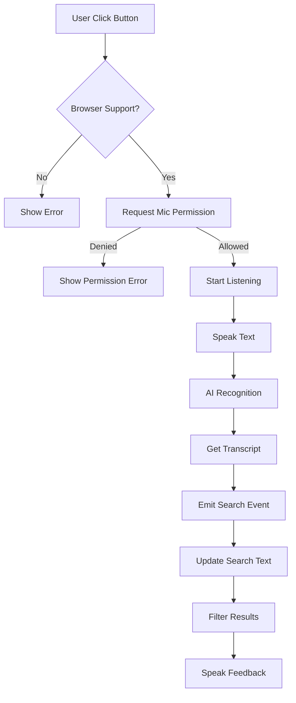

# 🎤 TÀI LIỆU TÍNH NĂNG AI - VOICE SEARCH (TÌM KIẾM BẰNG GIỌNG NÓI)

## 📋 TỔNG QUAN

Hệ thống Quản lý Thư viện đã được tích hợp **AI Voice Search** sử dụng **Web Speech API** - một công nghệ AI tự nhiên của trình duyệt để nhận diện và xử lý giọng nói người dùng.

### ✨ Tính năng chính:
1. 🎙️ **Speech-to-Text**: Nhận diện giọng nói tiếng Việt thành văn bản
2. 🔊 **Text-to-Speech**: Đọc phản hồi bằng giọng nói
3. 🔍 **Auto Search**: Tự động tìm kiếm khi nhận diện xong
4. 🌐 **Multilingual**: Hỗ trợ tiếng Việt (vi-VN)
5. 🎨 **Animated UI**: Giao diện đẹp với hiệu ứng sóng âm thanh

---

## 🏗️ KIẾN TRÚC

### Component Structure:
```
frontend/src/
├── components/
│   └── VoiceSearch.vue          # Reusable AI Voice Search component
└── views/
    ├── ClientBookList.vue       # Client: Tìm sách bằng giọng nói
    └── SachBook.vue              # Admin: Tìm sách bằng giọng nói
```

### Technology Stack:
- **Web Speech API** (Browser native)
  - `SpeechRecognition` / `webkitSpeechRecognition`
  - `SpeechSynthesis`
- **Vue.js 3** (Composition)
- **CSS Animations** (Pulse effects)

---

## 🎯 CÁCH SỬ DỤNG

### 1️⃣ **Cho Người Dùng (Client)**

**Bước 1:** Đăng nhập vào hệ thống
- Truy cập: `http://localhost:3001/client/login`

**Bước 2:** Vào trang Danh sách Sách
- Menu: "Danh sách Sách"

**Bước 3:** Sử dụng Voice Search
1. Click nút **🎤 Tìm bằng giọng nói (AI)**
2. Cho phép truy cập microphone (nếu được hỏi)
3. Nói tên sách, tác giả hoặc nhà xuất bản
   - Ví dụ: "Tìm sách Lập trình Python"
   - Ví dụ: "Tìm tác giả Nguyễn Văn A"
4. Hệ thống tự động tìm kiếm và hiển thị kết quả

**Bước 4:** Nghe phản hồi
- Hệ thống sẽ đọc: "Đang tìm kiếm [tên sách]"

---

### 2️⃣ **Cho Quản Trị Viên (Admin)**

**Bước 1:** Đăng nhập admin
- Truy cập: `http://localhost:3001/admin/login`

**Bước 2:** Vào Quản lý Sách
- Menu: "Quản lý Sách"

**Bước 3:** Sử dụng Voice Search giống như Client
- Click **🎤 Tìm sách bằng giọng nói (AI)**
- Nói tên sách cần tìm
- Xem kết quả tự động

---

## 🔧 CHI TIẾT KỸ THUẬT

### VoiceSearch Component

#### Props:
```javascript
{
  lang: 'vi-VN',              // Ngôn ngữ (Vietnamese)
  autoSearch: true,            // Tự động search sau khi nhận diện
  listeningText: 'Đang nghe...', // Text khi đang lắng nghe
  idleText: 'Tìm bằng giọng nói' // Text khi idle
}
```

#### Events:
```javascript
@search         // Emit khi có kết quả nhận diện (nếu autoSearch=true)
@transcript-change // Emit khi transcript thay đổi (real-time)
```

#### Methods:
```javascript
toggleVoiceSearch()   // Bật/tắt voice search
startListening()      // Bắt đầu lắng nghe
stopListening()       // Dừng lắng nghe
clearTranscript()     // Xóa transcript
speak(text)           // Text-to-Speech
speakText(text)       // Public method để đọc text tùy chỉnh
```

---

## 🌐 HỖ TRỢ TRÌNH DUYỆT

### ✅ Supported Browsers:
- ✅ **Google Chrome** 25+ (Full support)
- ✅ **Microsoft Edge** 79+ (Full support)
- ✅ **Safari** 14.1+ (macOS/iOS)
- ✅ **Opera** 27+

### ❌ Not Supported:
- ❌ Firefox (Experimental - cần bật flag)
- ❌ Internet Explorer (Không hỗ trợ)

### 📱 Mobile Support:
- ✅ **Android Chrome**: Full support
- ✅ **iOS Safari**: Partial support (iOS 14.5+)
- ⚠️ **Yêu cầu HTTPS** trên production

---

## 🎨 UI/UX FEATURES

### Button States:
1. **Idle**: Gradient tím (Purple) - Sẵn sàng
2. **Listening**: Gradient hồng (Pink) - Đang nghe với animation pulse
3. **Disabled**: Xám (Gray) - Trình duyệt không hỗ trợ

### Animations:
- **Pulse Ring**: 2 vòng tròn lan tỏa khi đang nghe
- **Slide In**: Transcript box trượt vào từ trên
- **Fade**: Error messages fade in/out

### Colors:
- **Primary**: `#667eea` → `#764ba2` (Idle)
- **Listening**: `#f093fb` → `#f5576c` (Active)
- **Transcript**: `#f5f7fa` → `#c3cfe2` (Background)

---

## 🔒 XỬ LÝ LỖI

### Lỗi thường gặp:

#### 1. `no-speech`
- **Nguyên nhân**: Không nhận được giọng nói
- **Giải pháp**: Nói to hơn, kiểm tra microphone

#### 2. `audio-capture`
- **Nguyên nhân**: Không tìm thấy microphone
- **Giải pháp**: Kiểm tra thiết bị, cắm microphone

#### 3. `not-allowed`
- **Nguyên nhân**: Quyền truy cập microphone bị từ chối
- **Giải pháp**: 
  - Chrome: Settings → Privacy → Site Settings → Microphone → Allow
  - Safari: Preferences → Websites → Microphone → Allow

#### 4. Browser không hỗ trợ
- **Hiển thị**: Alert thông báo "Trình duyệt không hỗ trợ"
- **Giải pháp**: Chuyển sang Chrome/Edge

---

## 📊 WORKFLOW



---

## 🧪 TESTING

### Test Cases:

#### 1. Basic Voice Search
- ✅ Click button → Microphone active
- ✅ Speak "Lập trình Python" → Search results appear
- ✅ Transcript displayed correctly

#### 2. Vietnamese Recognition
- ✅ "Tìm sách Toán học" → Recognizes correctly
- ✅ "Tác giả Nguyễn Văn A" → Recognizes correctly

#### 3. Error Handling
- ✅ No speech → Show error message
- ✅ Permission denied → Show permission error
- ✅ Unsupported browser → Disable button

#### 4. Text-to-Speech
- ✅ After recognition → Speaks "Đang tìm kiếm..."
- ✅ On start → Speaks "Tôi đang nghe"

---

## 💡 BEST PRACTICES

### Cho Developer:

1. **Always check browser support**
   ```javascript
   const SpeechRecognition = window.SpeechRecognition || window.webkitSpeechRecognition;
   if (!SpeechRecognition) {
     // Handle unsupported browser
   }
   ```

2. **Handle permissions gracefully**
   ```javascript
   recognition.onerror = (event) => {
     if (event.error === 'not-allowed') {
       // Guide user to enable permissions
     }
   };
   ```

3. **Use HTTPS in production**
   - Web Speech API requires secure context

4. **Cleanup on component unmount**
   ```javascript
   beforeUnmount() {
     this.stopListening();
   }
   ```

### Cho User:

1. **Nói rõ ràng, tốc độ vừa phải**
2. **Tránh tiếng ồn xung quanh**
3. **Cho phép quyền truy cập microphone**
4. **Sử dụng Chrome để có trải nghiệm tốt nhất**

---

## 🚀 FUTURE ENHANCEMENTS

### Planned Features:
- [ ] Offline voice recognition (với TensorFlow.js)
- [ ] Multi-language support (English, Chinese)
- [ ] Voice commands ("Mượn sách này", "Xóa sách")
- [ ] Custom wake word ("Này thư viện...")
- [ ] Voice analytics dashboard

---

## 📈 PERFORMANCE

### Metrics:
- **Recognition Time**: ~1-2 giây
- **Speech Synthesis**: ~0.5 giây
- **Component Size**: ~8KB (gzip)
- **No external dependencies**: ✅

### Optimization:
- Lazy loading component
- Debounce search để tránh search liên tục
- Cancel previous speech synthesis trước khi speak mới

---

## 🎓 TÀI LIỆU THAM KHẢO

- [Web Speech API - MDN](https://developer.mozilla.org/en-US/docs/Web/API/Web_Speech_API)
- [SpeechRecognition - W3C](https://w3c.github.io/speech-api/)
- [Vue.js 3 Documentation](https://vuejs.org/)

---

## 📝 CHANGELOG

### v1.0.0 (2025-11-16)
- ✅ Initial release
- ✅ Vietnamese speech recognition
- ✅ Text-to-Speech feedback
- ✅ Integration with ClientBookList
- ✅ Integration with SachBook (Admin)
- ✅ Responsive UI with animations

---

## 👨‍💻 CREDITS

**Developer**: Trần Công Huân (B2205869)  
**Course**: CT449 - Phát triển ứng dụng Web  
**Technology**: Web Speech API (Browser Native AI)  
**Framework**: Vue.js 3 + Node.js + Express.js + MongoDB

---

## 🎯 KẾT LUẬN

Tính năng **AI Voice Search** giúp:
- ✅ **Tăng trải nghiệm người dùng**: Tìm kiếm nhanh hơn, tiện lợi hơn
- ✅ **Accessibility**: Hỗ trợ người dùng khiếm thị hoặc khó gõ phím
- ✅ **Modern UI**: Giao diện hiện đại, chuyên nghiệp
- ✅ **Điểm cộng**: Tích hợp AI vào project (yêu cầu của thầy)

**🎉 Hệ thống hoàn chỉnh với AI Voice Search!**
